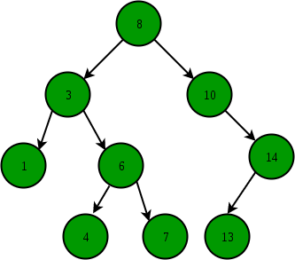

# Optional Problem 3
This problem is **optional** and is designed to give you extra practice with recursion by introducing you to another recursive data structure called the tree - specifically, a binary search tree. This problem is not graded, but will prepare you for what you'll learn in CPSC 131, and Leetcode / interview coding questions too (tree related interview questions come up quite often!) I highly recommend you try out this problem :)

Check out the additional [slides on Binary Search Trees here.](https://docs.google.com/presentation/d/1Hz-XGm4MUNX11VCEH6cqP-ygc-OiREfu7_R1-ij8-Uk/edit#slide=id.g17ec893389c_0_39)

## Binary Search
Searching over a `std::vector` may take a long time especially if the value you look for is at the end. Consider the case where we store 100 unique names in a `std::vector`, and the last element is the name "Tuffy". If we perform a linear search (search from index 0 to the 99), it will take us 99 tries before we find "Tuffy". It will take less time to find other names, but the worst case situation is the total number of elements in the `std::vector` also called O(n) (read as Big O of n), where n is the total number of elements.

Binary search trees (BST) are another way of representing data to make search faster. A binary search tree is a tree composed of nodes connected with at most 2 other nodes with no cycles. Each node has a value and the value of the nodes to its left should be smaller, while the nodes to its right should be larger. Below is an example of a BST.

Binary search will start searching from the root node. If the value is not in the node, it will continue searching on the left node if the value is smaller or on the right node if the value is larger. This process is repeated on the next node until the value is found or all nodes are explored.

Let's say we are looking for 13 on the sample BST.

1. Compare 8 against 13. It will continue searching on the right node because 8 < 13.
2. Compare 10 against 13. It will continue searching on the right node because 10 < 13.
3. Compare 14 against 13. It will continue searching on the left node because 14 > 13.
4. Found 13.

If we used a `std::vector` to store the same numbers in increasing order, it would take 9 steps to find 13 (from index 0 to 9). Binary search is faster with a O(log n).

# Product
Create a `Product` class that contains a name, a price, a pointer to a "left" `Product` (name occurs before the current product's name alphabetically), and a pointer to a "right" `Product` (name occurs affter the current product's name alphabetically).

Create a constructor that will accept values for all 4 inputs. Assume that the left and right `Product`s will appear before and after the current `Product` alphabetically.

Implement a recursive `FindPrice` member function that accepts the name of a `Product` and returns its price. If the product name does not match the product or any of its linked products, return -1.0.

*Not: The relational operations `<` and `>` also work for `std::string`s. For example `"apple" < "banana"` returns `true` because "apple" appears before "banana" alphabetically.* 