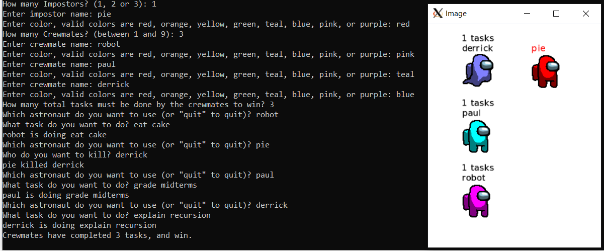

# Among Us: Character Classes

This lab practices with inheritance and function overriding by having you create characters from the game "Among Us".

We provide a very basic gameplay in ``main.cc``, and you do not need to edit this file (although you can edit it if you want! for example, add new colors or change the drawing!) ``main.cc``'s output isn't tested, but we do need your program to compile -- so make sure it compiles when you submit. Here's how it looks when you run the program:


When you run your code in Replit, please **click on Output** from the dock on the bottom left panel to **launch the Output window to display and draw your Astronaut characters**, if it isn't automatically opened for you.

You will create an ``Astronaut`` base class that stores the name and the color. This will be inherited by a ``Crewmate`` derived class which has some crewmate-specific functionality to do tasks and get/set whether it is alive, and also an ``Impostor`` derived class which has functionality to kill a ``Crewmate``.

## Game Overview

Knowledge of the real game is not important for implementing these classes. Here's how our version works:

Impostors and Crewmates look alike but have different goals. Both have names and colors, but while Crewmates can do tasks, Impostors try to kill Crewmates. If the Impostors kill all the Crewmates they win, but if the Crewmates complete a total number of tasks first, the Crewmates win instead.

Note that crewmates can continue to do tasks after they are not alive.

## The Astronaut class

Create an ``Astronaut`` class in ``astronaut.h`` and implement the functions in ``astronaut.cc``.

The ``Astronaut`` class should have a constructor that takes a ``std::string`` which is the astronaut's name, and a ``graphics::Color`` which is the astronaut's main color. Store these in member variables.

``Astronaut`` needs a const ``GetName`` function which returns its name, a ``std::string``.

The ``Astronaut`` class needs a const accessor function (getter) for the ``graphics::Color`` called ``GetColor``.

Finally, the ``Astronaut`` class needs a const function, ``GetIconFilename``, which returns a ``std::string`` filename of the icon to draw. ``Astronaut::GetIconFilename`` should return "astronaut.bmp".

## Create ``Crewmate`` class which inherits from ``Astronaut``

Create a ``Crewmate`` class in ``crewmate.h`` and implement its functions in ``crewmate.cc``. The ``Crewmate`` must inherit from ``Astronaut``.

``Crewmate`` has two private member variables, a boolean to track whether it is alive (default true), and a integer to track the task count (default 0). 

1. Non-default constructor: Since `Crewmate` inherits from `Astronaut`, the `Crewmate` constructors must initialize the base class, `Astronaut`.``Crewmate`` must have a constructor which takes a ``std::string`` name and a ``graphics::Color`` and calls the base class constructor. Remember to set the two private member variables to the defaults mentioned above.
2. Default constructor: In addition, `Crewmate` must also have a default constructor that takes no arguments, which calls the base class constructor and initializes the name to "no name", and the color to black, represented by RGB (0, 0, 0), which is created by constructing a `graphics::Color` object like so: `graphics::Color(0, 0, 0)`. Remember to set the two private member variables to the defaults mentioned above.
3. ``Crewmate`` should have a const getter, ``GetIsAlive``, and a setter called ``SetIsAlive``.
4. ``Crewmate`` should have a const getter for the task count called ``GetTaskCount``.
5. It should have a function called ``DoTask`` which takes a ``std::string`` parameter, the name of the task to do. When ``DoTask`` is called, ``Crewmate`` should increment its member variable for task count and also ``std::cout`` its name followed by " is doing " and then the task name, i.e. for a ``Crewmate`` named ``robot`` and a task called "gardening":

```
robot is doing gardening
```

6. ``Crewmate`` also overrides two functions from ``Astronaut``, ``GetColor`` and ``GetIconFilename``. Note that if you write the function declarations in ``crewmate.h`` for these overridden functions, and place the implementations in ``crewmate.cc``.

For both of these functions, if the ``Crewmate`` is alive you can return the result from the base class, i.e. ``Astronaut::GetColor()`` or ``Astronaut::GetIconFilename()`` respectively. **Note: it's important not to forget the `Astronaut::` prefix to avoid recursing infinitely!**

But if the ``Crewmate`` is dead, you will need to return a different result. For the filename, return "ghost.bmp" when the crewmate is dead. For the color, return the original color shifted 1/2 of the way to white. Here's how you can shift the color, assuming that you have a ``graphics::Color color`` which is the original color:

```cpp
graphics::Color shifted((color.Red() + 256) / 2,
                        (color.Green() + 256) / 2,
                        (color.Blue() + 256) / 2);
```

## Create ``Impostor`` class which inherits from ``Astronaut``

Create an ``Impostor`` class in ``impostor.h`` and implement its functions in ``impostor.cc``. The ``Impostor`` must inherit from ``Astronaut``. 

1. Non-default constructor: Since `Impostor` inherits from `Astronaut`, the `Impostor` constructors must initialize the base class, `Astronaut`. It must have a constructor which takes a ``std::string`` name and a ``graphics::Color`` and calls the base class constructor.
2. Default constructor: `Impostor` must also have a default constructor that takes no arguments. (For this you may pass any arguments you like to the non-default constructor.)
3. The ``Impostor`` class has one function, a ``Kill`` function which is const and  which takes a single parameter, a reference to a ``Crewmate``, i.e. a ``Crewmate&``. When the ``Kill`` function is called the ``Impostor`` class should print the impostor's name and who they killed, i.e. for an impostor named "pie" and a crewmate named "robot" it would ``std::cout``:

```
pie killed robot
```

### Ensure the ``Impostor`` changes ``Crewmate`` when ``Kill`` is called

``Impostor::Kill`` function should call ``Crewmate::SetIsAlive`` with ``false`` on the crewmate parameter.

# Code Evaluation

If you're using Replit, you can click the "Run" button and follow the prompts to build and test your code.

Otherwise:

Use the `make build` command to compile your code and save it into an executable file called `main`.
Then you can use the `./` command to run it. Take note that if you make any changes to your code, you will need to compile it first before you see changes when running it.

```
make build
./main
```

Alternatively, you can use the `clang++` command to compile your code and the `./` command to run it. 
The sample code below shows how you would compile code in `star.cc` and `main.cc` and into the executable file `main`. 

```
clang++ -std=c++17 main.cc crewmate.cc impostor.cc astronaut.cc cpputils/graphics/image.cc -o main -lm -lX11 -lpthread
```

## Run the unit tests

We've provided unit tests, which you can try with ``make test``. Use the output to help you debug any issues in your program.
For code style, make sure you follow advice from the stylechecker using ``make stylecheck``.
For code formatting, make sure you follow advice from the formatchecker to improve code readbility using ``make formatcheck``.

# Submission
1. When everything runs correctly,  let's copy your code into the GitHub repository. The first step is to add your code to what is called the staging area using git's `add` command. The parameter after `add` is the name of the file you want to add. There are cases when you have multiple changed files, so you can just type `git add .` (period) to add all modified files.

    ```
    git add main.cc
    ```
1. Once everything is in the staging area, we use the `commit` command to tell git that we have added everything we need into the staging area.

    ```
    git commit -m "Your description here"
    ```
1. In case it asks you  to configure global variables for an email and name, just copy the commands it provides then replace the dummy text with your email and Github username.

    ```
    git config --global user.email "tuffy@csu.fullerton.edu"
    git config --global user.name "Tuffy Titan"
    ```
    When you're done, make sure you type the `git commit -m "Your description here"` command again.    
1. Lets push all changes to the Github repository using git's `push` command. Provide your Github username and personal access token when you are asked.

    ```
    git push
    ```
1. Once you push, the autograder is automatically kicked off. Check the results in the 'Actions' tab - a green check means that all tests passed.
